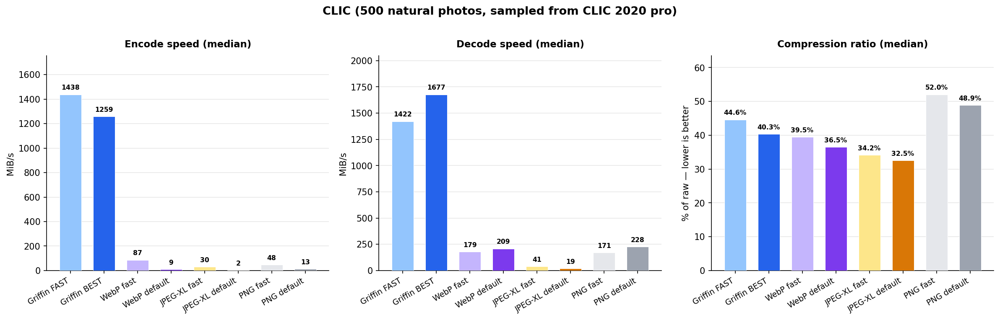
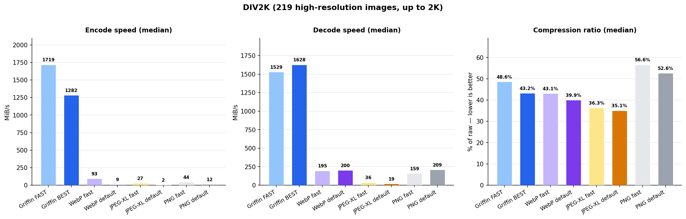
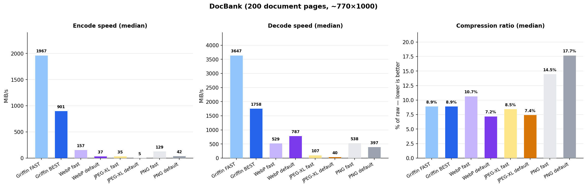

# Griffin

Fast lossless image codec that compresses better than PNG.

Griffin automatically adapts its compression strategy to the image content — using Huffman entropy coding for photographic images and dictionary compression for text/document images. No manual tuning needed.

**Portable by default.** This distribution ships as a single WebAssembly binary that runs on **any OS/arch**: Linux, macOS, Windows; x86_64, aarch64. No CPU feature requirements, no per-platform builds.

---

## CLI — getting started

### Step 1 — clone the repo

```bash
git clone https://github.com/AurynRobotics/dvid3-codec.git
cd dvid3-codec
```

### Step 2 — install the wasm runtime

**Linux / macOS / WSL** — the launcher script installs `wasmtime` to `~/.wasmtime/bin`, no root required:

```bash
bash bin/install-wasmtime.sh
```

Or use the [official one-liner](https://docs.wasmtime.dev/cli-install.html) directly:

```bash
curl https://wasmtime.dev/install.sh -sSf | bash
```

On macOS you can also use Homebrew: `brew install wasmtime`.

After install, either open a fresh shell or add wasmtime to your current session:

```bash
export PATH="$HOME/.wasmtime/bin:$PATH"
```

**Windows** — open **PowerShell** (no admin required) and run:

```powershell
iwr https://wasmtime.dev/install.ps1 -useb | iex
```

This installs `wasmtime` to `%USERPROFILE%\.wasmtime\bin` and adds it to your user PATH. **Reopen PowerShell** for it to take effect, then verify with `wasmtime --version`.

### Step 3 — encode and decode

```bash
# Single file (use bin\dvid3.cmd on Windows)
bin/dvid3 encode --in photo.png   --out photo.grif
bin/dvid3 decode --in photo.grif  --out photo.png

# Compression levels: fast (default), best (max ratio)
bin/dvid3 encode --level fast --in photo.png --out photo.grif
bin/dvid3 encode --level best --in photo.png --out photo.grif

# Batch — whole directory with CSV report
bin/dvid3 encode --in images/  --out encoded/  --report encode.csv
bin/dvid3 decode --in encoded/ --out decoded/  --report decode.csv
```

---

## Full reference

```
Usage:
  bin/dvid3 <command> [options]            # Linux / macOS / WSL
  bin\dvid3.cmd <command> [options]        # Windows

Commands:
  encode    Compress a PNG image to .grif format
  decode    Decompress a .grif file back to PNG

Options:
  --in <file|dir>          Input file or directory
  --out <file|dir>         Output file or directory
  --level fast|best        Compression level (default: fast)
  --report <file.csv>      Write per-file CSV report (size, ratio, MiB/s)
```

The CSV report contains per-file size, compression ratio, and codec throughput (MiB/s).
Paths can be relative or absolute; the launcher handles wasm sandboxing automatically.

---

## Benchmarks

All speeds are raw pixel throughput (width × height × channels / time), single core, best-of-3 iterations. Ratio is encoded size / uncompressed size using the original channel count.

**Methodology:** Single core (Intel Core i7-13700H P-core), sequential execution, pre-allocated buffers and reusable contexts. Each reference codec is shown at a fast and a default setting:
- **WebP fast** = lossless `method=0`. **WebP default** = lossless `method=4`.
- **JPEG-XL fast** = lossless `effort=3`. **JPEG-XL default** = lossless `effort=7`.
- **PNG L1** = libpng level 1 (fastest). **PNG L6** = libpng level 6 (default).

Bar order in every chart: **Griffin FAST · Griffin BEST · WebP fast · WebP default · JPEG-XL fast · JPEG-XL default · PNG L1 · PNG L6**.

### Datasets

- **CLIC** — 500 images sampled (deterministic seed) from the [CLIC 2020 professional training set](https://data.vision.ee.ethz.ch/cvl/clic/professional_train_2020.zip) (~1.9 GB). Mixed-resolution natural photography.
- **DIV2K** — 800 high-resolution natural images from the [DIV2K dataset](https://data.vision.ee.ethz.ch/cvl/DIV2K/) (~3.3 GB). Standard super-resolution training set.
- **DocBank** — 200 rendered PDF pages from the [DocBank dataset](https://doc-analysis.github.io/docbank-page/). Academic papers with text + figures + tables.

### CLIC dataset (500 natural-photo images sampled from CLIC 2020 professional training)

Diverse natural-photography content — the most representative "compress a pile of photos" workload.




### DIV2K dataset (800 high-resolution training images, up to 2K)

High-resolution natural photography — stresses both ratio and throughput at large image sizes.




### DocBank dataset (200 document pages, ~770×1000 RGB)

Rendered academic-paper pages — text and figures. Griffin's zero-count gate routes both levels to zstd here, since document residuals are zero-heavy.




## Note on benchmarks and the WebAssembly distribution

**The numbers below were measured with the native AVX2 build** of Griffin
(`-march=haswell`, no wasm runtime). They reflect the codec's raw algorithmic
performance on bare metal.

**This distribution ships a WebAssembly build, not the native binary.** We
made that choice deliberately:

1. **Portability** — a single `.wasm` artifact runs on Linux, macOS, Windows
   and on x86_64, aarch64, riscv64 alike. No per-platform builds, no AVX2
   requirement, no install friction.
2. **Strong sandboxing** — WebAssembly executes in an isolated memory space
   with no access to arbitrary syscalls, the network, or files outside the
   directories you explicitly grant. A malicious or buggy codec can't read
   your SSH keys, write to `~`, or exfiltrate anything.

Expect the wasm CLI to land within ~10% of the native numbers in your own
measurements, and the Python path around 20–30% lower than native. Ratios
(compression effectiveness) are identical — the algorithm is unchanged.

---

## Python

### Quick start

```bash
pip install -e .
```

```python
import griffin
import numpy as np
from PIL import Image

img = np.array(Image.open("photo.png").convert("RGBA"))
encoded = griffin.encode(img)
decoded = griffin.decode(encoded)
```

Works on any Python 3.9+ on Linux, macOS, Windows. `wasmtime` and `numpy` are
pulled in automatically as dependencies.

### Full API

```python
import griffin
import numpy as np
from PIL import Image

img = np.array(Image.open("photo.png").convert("RGBA"))

# Basic encode/decode
encoded = griffin.encode(img)                 # bytes
decoded = griffin.decode(encoded)             # (H, W, 4) uint8 ndarray

# Explicit compression level
encoded = griffin.encode(img, level=1)        # 0=fast (default), 1=best

# Timed variants — returns (result, seconds_in_codec) for benchmarking
encoded, enc_s = griffin.encode_timed(img)
decoded, dec_s = griffin.decode_timed(encoded)
```

Input must be an `(H, W, 4)` uint8 numpy array. Use PIL's `.convert("RGBA")` if your source is RGB.

### Benchmark your own images

```bash
python bench_codecs.py images/tecnick/
```

(`bench_codecs.py` lives next to this README. `pip install pillow numpy` first if you don't have them.)

---

## Troubleshooting

### `error: wasmtime not found` (Linux / macOS)
Run `bash bin/install-wasmtime.sh`, or use the official installer directly:
```bash
curl https://wasmtime.dev/install.sh -sSf | bash
```
After install, either open a fresh shell or run:
```bash
export PATH="$HOME/.wasmtime/bin:$PATH"
```

### `error: wasmtime not found` (Windows)
Run the PowerShell installer:
```powershell
iwr https://wasmtime.dev/install.ps1 -useb | iex
```
Then **reopen PowerShell** — the installer updates your user PATH automatically.

### `ModuleNotFoundError: No module named 'wasmtime'` (Python)
You forgot to install the package. From the cloned repo root: `pip install -e .`
(or install the runtime deps directly: `pip install wasmtime numpy`).

### Slow first call in Python
The first `griffin.encode(...)` or `griffin.decode(...)` call pays a ~5 ms one-time cost to instantiate the wasm module. Subsequent calls reuse the instance and are full-speed.

### `can't fopen` on CLI
Your file path may not be inside a preopened directory. The launcher automatically grants access to `$(pwd)` and to the parent dirs of `--in`/`--out`/`--report` arguments; just avoid passing paths that cross symlinks outside of those.

---

## License

Released for **non-commercial evaluation only**. No warranty. See [LICENSE](LICENSE) for details.

This software uses third-party libraries under their respective open-source licenses. See [THIRD_PARTY_NOTICES](THIRD_PARTY_NOTICES) for full license texts.

For commercial licensing: dfaconti@aurynrobotics.com
