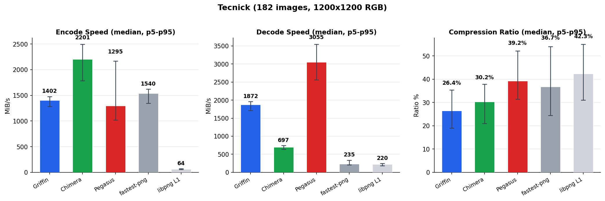

# dvid3

Fast lossless image codecs that compress better than PNG at 10-200x the speed.

## Codecs

- **Griffin** — Best compression ratio (26% on Tecnick). Compresses smaller than PNG while encoding at 1375 MiB/s.
- **Chimera** — Fastest encoder (2127 MiB/s on Tecnick). Outputs valid PNG files that any viewer can open.
- **Pegasus** — Fastest decoder (3038 MiB/s on Tecnick). Optimized for real-time playback and low-latency pipelines.

## Benchmarks

All speeds are raw pixel throughput (width x height x 4 / time), single core, best-of-N iterations.

**Methodology:** All codecs (ours and baselines) use the same measurement approach: pre-allocated output buffers and reusable codec contexts, so timing reflects codec work only — no memory allocation in the hot path. This matches how a performance-conscious integration would use these codecs in production. Measured on an Intel Core i7-13700H (single P-core).

### Tecnick dataset (182 images, 1200x1200 RGB)

| Codec | Ratio | Encode (MiB/s) | Decode (MiB/s) |
|-------|------:|---------------:|---------------:|
| **Griffin** | **26.3%** | **1375** | **1852** |
| **Chimera** | **29.1%** | **2127** | **693** |
| **Pegasus** | **40.1%** | **1360** | **3038** |
| fpnge+libdeflate | 37.4% | 1454 | 241 |
| libpng L1 | 41.6% | 64 | 218 |

### Kodak dataset (24 images, 768x512)

| Codec | Ratio | Encode (MiB/s) | Decode (MiB/s) |
|-------|------:|---------------:|---------------:|
| **Griffin** | **35.3%** | **1297** | **1843** |
| **Chimera** | **40.5%** | **2083** | **651** |
| **Pegasus** | **46.5%** | **1894** | **4223** |
| fpnge+libdeflate | 53.1% | 1319 | 298 |
| libpng L1 | 49.3% | 61 | 209 |

Lower ratio = better compression. Higher MiB/s = faster.

**Baselines:** "fpnge+libdeflate" (labeled "fastest-png" in the chart) combines [fpnge](https://github.com/nickthetimid/fpnge) for encoding and [libdeflate](https://github.com/nickthetimid/libdeflate) for decoding — the fastest known PNG encode/decode pipeline. "libpng L1" is the standard libpng at compression level 1 (fastest setting). Both baselines use pre-allocated buffers, same as our codecs.



## Datasets

- **Tecnick** — 182 photographic images at 1200x1200 from the [Tecnick SAMPLING dataset](https://sourceforge.net/projects/testimages/files/SAMPLING_8BIT_RGB_1200x1200.tar.bz2/download). The standard benchmark for lossless image codec evaluation.
- **Kodak** — 24 classic PhotoCD images at 768x512. Included in this repository under `images/kodak/`.

### Downloading datasets

The Kodak dataset is included in this repository. To download the Tecnick dataset:

```bash
# Download and extract Tecnick (182 images, ~370 MB)
curl -L "https://sourceforge.net/projects/testimages/files/SAMPLING_8BIT_RGB_1200x1200.tar.bz2/download" -o tecnick.tar.bz2
mkdir -p images/tecnick
tar xjf tecnick.tar.bz2 -C images/tecnick
rm tecnick.tar.bz2
```

Then run benchmarks on either dataset:

```bash
# Using the AppImage CLI
./bin/dvid3-x86_64.AppImage encode --codec griffin --in images/kodak --out /tmp/encoded --force --report kodak_encode.csv
./bin/dvid3-x86_64.AppImage decode --in /tmp/encoded --out /tmp/decoded --force --report kodak_decode.csv

# Using the Python module
PYTHONPATH=python python bench_griffin.py images/kodak/
```

Replace `griffin` with `chimera` or `pegasus` to benchmark different codecs.

## Independent evaluation

Pre-built binaries are available so the community can independently reproduce and verify these results on their own hardware and datasets.

### AppImage CLI (Linux x86_64)

Single-file executable, no dependencies. Available in the `bin/` directory. Supports single-file and batch (directory) mode with per-file CSV reporting.

```bash
chmod +x bin/dvid3-x86_64.AppImage

# Single file
./bin/dvid3-x86_64.AppImage encode --codec griffin --in photo.png --out photo.grif
./bin/dvid3-x86_64.AppImage decode --in photo.grif --out photo.png

# Batch encode a directory (recursive), with per-file CSV report
./dvid3-x86_64.AppImage encode --codec griffin --in images/ --out encoded/ --force --report encode.csv

# Batch decode
./dvid3-x86_64.AppImage decode --in encoded/ --out decoded/ --force --report decode.csv
```

Batch mode measures codec time only (excludes PNG load/save I/O), reuses contexts and pre-allocated buffers, and prints aggregate statistics with avg/median/p5/p95 speeds.

### C static libraries

Pre-built static libraries and headers for all three codecs are in the `bin/` directory:

| Codec | Library | Header |
|-------|---------|--------|
| Griffin | `libgriffin.a` | `griffin.h` |
| Pegasus | `libpegasus.a` | `pegasus.h` |
| Chimera | `libchimera.a` | `chimera.h` |

All three share the same API pattern. Pure C, caller owns all memory:

```c
#include "griffin.h"  // or pegasus.h, chimera.h

uint8_t out[griffin_encode_max_size(width, height)];
int encoded_size = griffin_encode(pixels, width, height, out, sizeof(out));

// Timed variant excludes caller overhead
double seconds;
int encoded_size = griffin_encode_timed(pixels, w, h, out, sizeof(out), &seconds);
```

Compile and link:
```bash
gcc -I bin/ my_benchmark.c bin/libgriffin.a -lstdc++ -lpthread -o my_benchmark
```

### Python (Linux x86_64, Python 3.12+)

Pre-built native modules for all three codecs are in `python/`. To use:

```bash
pip install numpy pillow   # dependencies

# Benchmark all codecs
PYTHONPATH=python python bench_codecs.py images/kodak/

# Benchmark a specific codec
PYTHONPATH=python python bench_codecs.py images/kodak/ --codec griffin
```

The modules provide identical APIs:

```python
import griffin   # or pegasus, chimera
import numpy as np
from PIL import Image

img = np.array(Image.open("photo.png").convert("RGBA"))

encoded = griffin.encode(img)
decoded = griffin.decode(encoded)

# Timed variants for benchmarking (measures codec time only)
encoded, enc_seconds = griffin.encode_timed(img)
decoded, dec_seconds = griffin.decode_timed(encoded)
```

## CPU requirements

All codecs require **AVX2** (Intel Haswell 2013+ / AMD Excavator 2015+). The Python module checks at import time and raises a clear error on unsupported CPUs.

## License

Released for **non-commercial evaluation only**. No warranty. See [LICENSE](LICENSE) for details.

This software uses third-party libraries (zstd, fpnge, LZ4, libdeflate, zpng, libpng) under their respective open-source licenses. See [THIRD_PARTY_NOTICES](THIRD_PARTY_NOTICES) for full license texts.

For commercial licensing: dfaconti@aurynrobotics.com

